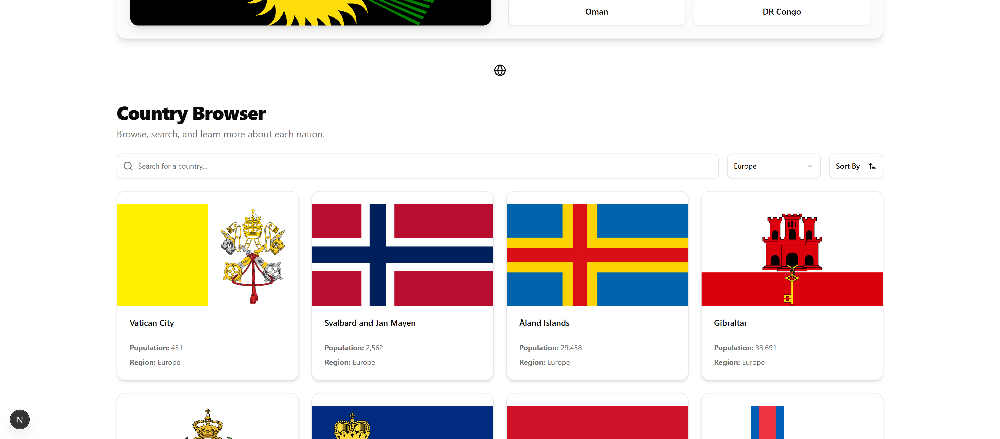

# Countries of the World



An interactive and beautifully designed web application that allows users to explore countries from around the world. Search for specific nations, filter by region, and test your geography skills with a "Guess the Flag" game. This project was built as a portfolio piece to demonstrate modern, full-stack web development capabilities using Next.js and shadcn/ui.

**Live Demo:** [Link to demo](https://leokhani.com)

---

## Features

- **Interactive World Map & Country List:** Browse all countries in a clean, responsive grid.
- **Dynamic Search:** Instantly find any country by typing its name.
- **Advanced Filtering & Sorting:**
  - Filter the list by continent (e.g., Europe, Asia, Americas).
  - Sort countries by name (A-Z, Z-A), population, or land area.
- **Detailed Country Pages:** Click on any country to view comprehensive information, including:
  - Official Name, Capital, Population, Area
  - Region and Subregion
  - Native Languages and Currencies
  - Bordering countries (with clickable links to navigate between them)
  - Coat of Arms and a link to its location on Google Maps.
- **"Guess the Flag" Game:** A fun, interactive quiz to test your knowledge of world flags.
- **Dark Mode:** A stunning, theme-aware dark mode for comfortable viewing at any time.
- **Fully Responsive:** The entire application is designed to work flawlessly on all devices, from mobile phones to widescreen desktops.

---

## Tech Stack

This project was built using a modern, professional technology stack to ensure performance, maintainability, and a great developer experience.

- **Framework:** **Next.js 15** (App Router)
- **Language:** **TypeScript**
- **Styling:** **Tailwind CSS**
- **UI Components:** **shadcn/ui** - A component library built on Radix UI and Tailwind CSS for creating beautiful, accessible interfaces.
- **Icons:** **Lucide React**
- **API:** [REST Countries API](https://restcountries.com/) for all geographical data.
- **Deployment:** Vercel (or your hosting platform)

---

## Getting Started

To get a local copy up and running, follow these simple steps.

### Prerequisites

Make sure you have Node.js (version 18.x or newer) and npm/yarn/pnpm installed on your machine.

### Installation & Setup

1.  **Clone the repository:**

    ```bash
    git clone [https://github.com/your-username/your-repo-name.git](https://github.com/your-username/your-repo-name.git)
    ```

2.  **Navigate to the project directory:**

    ```bash
    cd your-repo-name
    ```

3.  **Install dependencies:**

    ```bash
    npm install
    # or
    yarn install
    # or
    pnpm install
    ```

4.  **Run the development server:**
    ```bash
    npm run dev
    # or
    yarn dev
    # or
    pnpm dev
    ```

Open <http://localhost:3000> with your browser to see the result.

---

## Contact

This project was designed and developed by **Leo Khani**.

- **Portfolio:** [LeoKhani.com](https://leokhani.com)
- **GitHub:** [@your-github-username](https://github.com/your-github-username)
